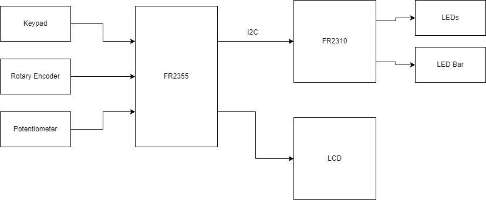
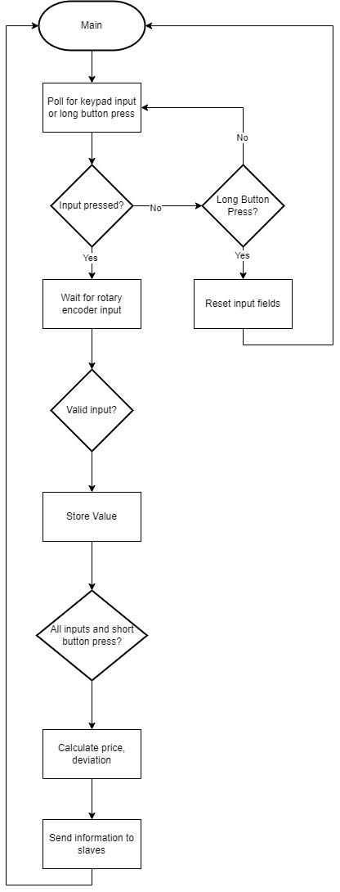

# Final project proposal

- [x] I have reviewed the project guidelines.
- [x] I will be working alone on this project.
- [x] No significant portion of this project will be (or has been) used in other course work.

## Embedded System Description

My embedded system will show option pricing differences in expected vs. actual option prices.  The inputs will be current actual price of option, strike price, time-to-expiration, interest free rate, and implied volatility. The master will use this information to calculate an expected option price. For outputs, the master device will display the expected price of the option, and then display distance between expected and actual stock price.  The slave will then determine if the difference is a "buy or sell", and display the deviation in percentage on the LED bar.

## Hardware Setup

The master device will be the MSP430FR2355, which will use the FR2310 as the slave.  The master will be used to select type of input from the keypad and enter it, a rotary encoder for intrinsic volatility, and the potentiometer and the ADC to change input values.  The master will communicate via i2c with the slave device, the FR3210, which will control the LCD will be used to display expected option price, the LED bar will be used to show the difference in expected vs. actual option price, and LED's will be used to determine "buy, sell, or stay" 

## Software overview

Discuss, at a high level, a concept of how your code will work. Include a *high-level* flowchart. This is a high-level concept that should concisely communicate the project's concept.

## Testing Procedure

As far as testing procedure, I would like to show that my model is within a certain threshold next to a trusted online options price calculator.  The LCD will display what input you have selected with the keypad, and show that edge cases (zero volatility) will not crash the system.  If all my inputs map to the correct input name, display correctly on the LCD, LED Bar, and RGB LED, and the expected price is within 5% of a trusted online calculator with the same inputs, I think this project is a success.

## Prescaler

Desired Prescaler level: 

- [ ] 100%
- [x] 95% 
- [ ] 90% 
- [ ] 85% 
- [ ] 80% 
- [ ] 75% 

### Prescalar requirements 

**Outline how you meet the requirements for your desired prescalar level**

**The inputs to the system will be:**
1.  Keypad - select type parameter to adjust(option price, strike price, implied volatility, risk free rate, days-to-expiration)
2.  Rotary encoder - change value of parameter
3.  Push Button - confirm parameter and run calculation with short press. Reset parameter inquiry with long press.

**The outputs of the system will be:**
1. LCD screen to show input option price, and expected option price.
2. LED bar to show how far different input option price is from expected option price in percentage(%).
3. RGB LED shows Buy, Sell, or Stay (Green, Red, Yellow)
	deviation < 5%: Stay (Yellow)
	market price < expected price > 5%: Buy (Green)
	market price > expected price > 5%: Sell (Red)

**The project objective is**
Implement an option price calculator on the MSP430, with "signal generating functionality", which is the RGB LED telling you to buy, sell, or stay.

**The new hardware or software modules are:**
1. The rotary encoder is a new module, we have not yet used it. It will be used to input values for the different parameters.
2. As far as a Black-Scholes module, this will be interesting to implement. Will have to look in to how to implement a log normal distribution simplification.

The Master will be responsible for: Handling user input, and doing Black-Scholes model calculations, sending information to slave via I2C.

The Slave(s) will be responsible for: Taking information from Master (expected and market option prices, deviation), then setting LEDs and LED bar.

### Argument for Desired Prescaler

	Shooting for 95% because I have 3 inputs and 3 outputs, I'm using a new piece of hardware (the rotary encoder), and the software calculation using a Black-Scholes model is new and difficult as I see it.  There will need to be approximations for a normal distribution. This is a real world application of the MSP430, as trading desks use (much more complex than this) versions of this to make decisions. 

